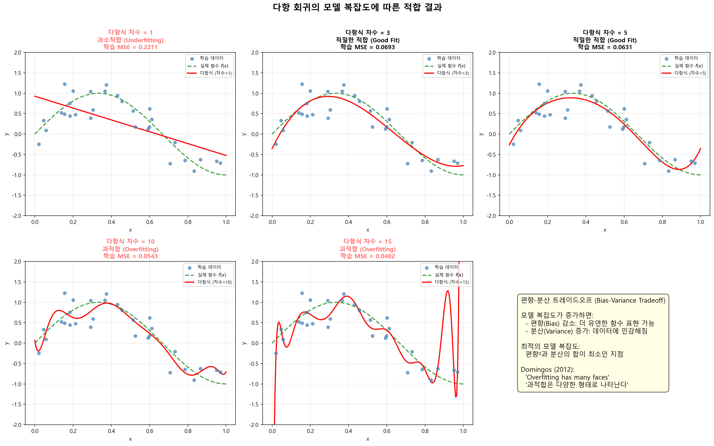
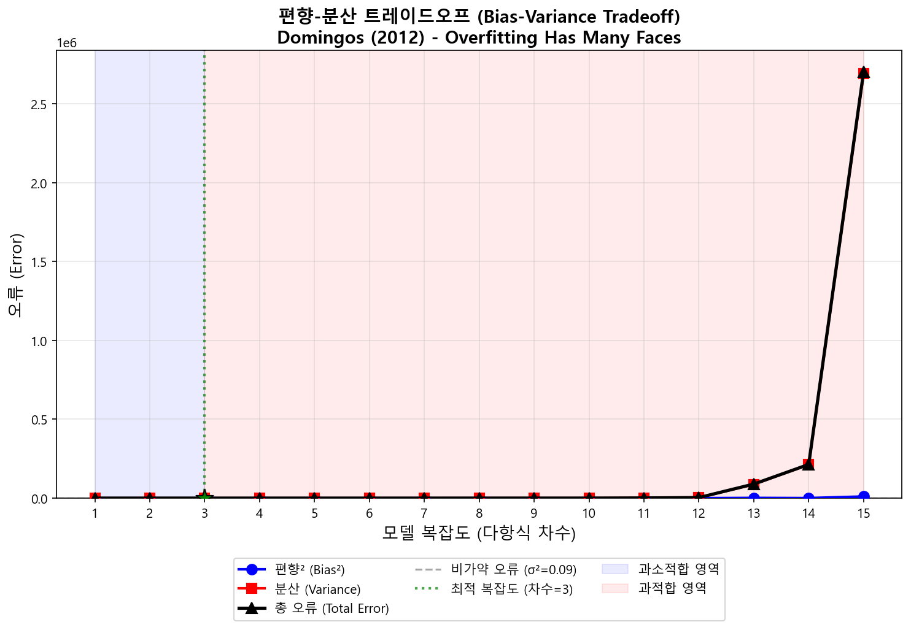
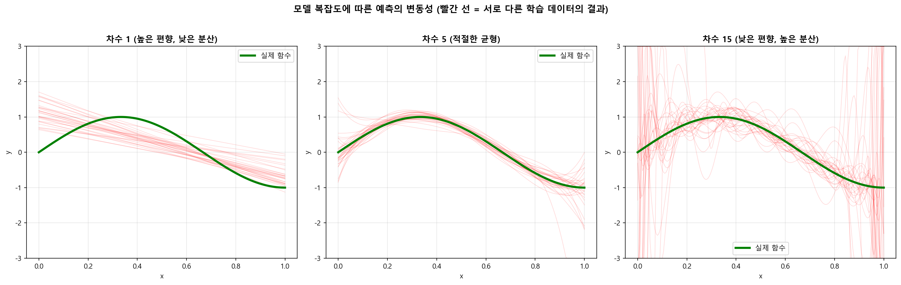

# 01. 편향-분산 트레이드오프 (Bias-Variance Tradeoff) 시뮬레이션

## 개요

| 항목 | 내용 |
|------|------|
| **파일명** | `01_bias_variance_tradeoff.py` |
| **주제** | 편향-분산 트레이드오프 시각화 |
| **참고 논문** | Pedro Domingos (2012) "A Few Useful Things to Know About Machine Learning" |
| **핵심 라이브러리** | NumPy, Matplotlib, scikit-learn |
| **생성 결과물** | `01_model_fits.png`, `01_bias_variance_tradeoff.png`, `01_prediction_variability.png` |

---

## 먼저 알아야 할 것: 머신러닝의 목표란?

머신러닝의 최종 목표는 **"아직 보지 못한 새로운 데이터"에 대해 정확하게 예측하는 것**이다. 이것을 **일반화(Generalization)** 라고 부른다.

여기서 많은 초보자가 빠지는 함정이 있다:

- "학습 데이터에서 100점을 맞으면 좋은 모델 아닌가요?" → **아니다!**
- 시험에 비유하면, 기출문제(학습 데이터)를 통째로 외운 학생은 기출에서는 만점을 받지만, 새로운 문제(테스트 데이터)에서는 크게 틀릴 수 있다.
- 반대로, 너무 대충 공부한 학생은 기출에서도, 새 문제에서도 잘 못 푼다.

**이 코드는 바로 이 딜레마를 수학적으로 보여준다.** "얼마나 열심히(복잡하게) 학습해야 최적인가?"라는 질문에 대한 답을 시각화한다.

---

## 이론적 배경: 편향과 분산이란?

### 일상 속 비유로 이해하기

과녁 맞추기를 상상해보자. 10번 활을 쏜다고 하면:

- **편향(Bias)이 높다** = 화살이 항상 과녁의 **왼쪽 아래**에 몰린다. 즉, **체계적으로 빗나가는 것**이다. 조준 자체가 잘못되어 있다.
- **분산(Variance)이 높다** = 화살이 매번 **사방팔방** 다른 곳에 꽂힌다. 즉, **일관성이 없는 것**이다. 조준은 맞지만 손이 떨린다.
- **좋은 사수** = 편향도 낮고 분산도 낮다. 화살이 항상 과녁 중심에 모인다.

| 상태 | 편향 | 분산 | 비유 |
|------|------|------|------|
| 이상적 | 낮음 | 낮음 | 매번 과녁 한가운데에 적중 |
| 과소적합 | 높음 | 낮음 | 항상 같은 곳에 맞지만, 과녁 중심이 아님 |
| 과적합 | 낮음 | 높음 | 평균적으로는 중심이지만, 매번 다른 곳에 맞음 |
| 최악 | 높음 | 높음 | 사방으로 흩어지면서 중심도 빗나감 |

### 머신러닝에서의 의미

이것을 머신러닝 모델에 대입하면:

- **편향(Bias)** = 모델이 **실제 패턴을 얼마나 잘 포착하는가**
  - 편향이 높다 = 모델이 너무 단순해서 데이터의 진짜 패턴을 놓친다
  - 예: 곡선 형태의 데이터를 직선으로 예측하려는 경우
- **분산(Variance)** = 모델이 **학습 데이터에 얼마나 민감한가**
  - 분산이 높다 = 학습 데이터가 조금만 바뀌어도 예측이 완전히 달라진다
  - 예: 데이터의 노이즈(잡음)까지 외워버리는 경우

### 수학적 표현

모델의 **기대 예측 오류(Expected Prediction Error)** 는 다음 세 가지로 분해된다:

$$
E\left[(y - \hat{f}(x))^2\right] = \text{Bias}^2(\hat{f}(x)) + \text{Var}(\hat{f}(x)) + \sigma^2
$$

각 항목을 쉽게 풀어 설명하면:

| 항목 | 수학 기호 | 쉬운 설명 | 줄일 수 있나? |
|------|----------|----------|-------------|
| **편향²** | $\text{Bias}^2(\hat{f}(x))$ | 모델의 "평균 예측"이 정답에서 얼마나 떨어져 있나 | 모델을 복잡하게 만들면 줄어듦 |
| **분산** | $\text{Var}(\hat{f}(x))$ | 학습 데이터가 바뀔 때 예측이 얼마나 흔들리나 | 모델을 단순하게 만들면 줄어듦 |
| **비가약 오류** | $\sigma^2$ | 데이터 자체의 노이즈 (줄일 수 없음) | 불가능! 데이터의 한계 |

**핵심 딜레마**: 편향을 줄이려면 모델을 복잡하게 만들어야 하는데, 그러면 분산이 올라간다. 반대로 분산을 줄이려면 모델을 단순하게 해야 하는데, 그러면 편향이 올라간다. 이것이 바로 **트레이드오프(상충 관계)** 이다.

---

## 이 코드가 하는 일: 전체 그림

이 코드는 **다항 회귀(Polynomial Regression)** 를 사용하여 편향-분산 트레이드오프를 직접 실험한다.

### 다항 회귀란?

가장 단순한 회귀 모델은 직선($y = ax + b$)이다. 다항 회귀는 이를 확장하여 곡선을 그릴 수 있게 한다:

- **차수 1** (직선): $y = a_1 x + a_0$
- **차수 2** (포물선): $y = a_2 x^2 + a_1 x + a_0$
- **차수 3**: $y = a_3 x^3 + a_2 x^2 + a_1 x + a_0$
- **차수 15**: $y = a_{15} x^{15} + \cdots + a_1 x + a_0$

**차수가 높을수록 모델이 더 복잡한 곡선을 그릴 수 있다.** 이 코드에서는 차수를 1부터 15까지 변화시키면서 "어떤 차수가 최적인가?"를 실험한다.

### 실험 설계

1. **정답 함수**: $f(x) = \sin(1.5\pi x)$ — 우리가 맞추려는 실제 곡선
2. **학습 데이터**: 정답 함수에 **노이즈(잡음)** 를 더한 30개 점 — 현실에서는 데이터에 항상 측정 오차가 있다
3. **실험 반복**: 노이즈가 매번 다르므로, **200개의 서로 다른 학습 데이터셋**을 만들어 통계적으로 분석
4. **결과 비교**: 차수 1~15의 모델별로 편향², 분산, 총 오류를 계산

---

## 코드 상세 설명

### 1. 정답 함수 정의

```python
def true_function(x):
    return np.sin(1.5 * np.pi * x)
```

- 이것은 우리가 알아내고 싶은 **"진짜 정답"** 이다
- 실제 세계에서는 이 정답을 모르지만, 시뮬레이션에서는 알고 있으므로 모델의 성능을 정확히 측정할 수 있다
- $\sin$ 함수는 곡선이므로, 직선 모델로는 완벽히 포착할 수 없다 → 이것이 편향의 원인이 된다

### 2. 합성 데이터 생성

```python
def generate_data(n_samples=30, noise_std=0.3):
    X = np.sort(np.random.uniform(0, 1, n_samples))
    y = true_function(X) + np.random.normal(0, noise_std, n_samples)
    return X, y
```

**이 함수가 하는 일을 단계별로 설명하면:**

1. `np.random.uniform(0, 1, 30)` → 0과 1 사이에서 30개의 X값을 무작위로 뽑는다
2. `true_function(X)` → 각 X에 대한 "진짜 정답" y값을 계산한다
3. `+ np.random.normal(0, 0.3, 30)` → 정답에 **노이즈를 더한다** ($\sigma = 0.3$)

**왜 노이즈를 더하나?** 현실의 데이터는 항상 측정 오차, 미관측 변수 등으로 인해 완벽하지 않다. 예를 들어 키와 몸무게의 관계를 수집하면, 같은 키여도 사람마다 몸무게가 다르다. 이 "다름"이 바로 노이즈다.

**핵심**: 이 함수를 호출할 때마다 **다른 노이즈가 추가**되므로, 매번 조금씩 다른 데이터셋이 만들어진다. 이 특성을 이용하여 "다른 데이터로 학습하면 모델이 얼마나 달라지는가"(=분산)를 측정한다.

### 3. 편향-분산 계산 — 핵심 엔진

```python
def compute_bias_variance(degrees, n_datasets=200, n_samples=30,
                          noise_std=0.3, n_test=100):
```

이 함수가 이 프로그램의 **핵심**이다. 동작 원리를 단계별로 설명한다:

**[준비 단계]**
- 테스트 포인트 100개를 고정한다 (`X_test = np.linspace(0, 1, 100)`)
- 이 포인트에서의 진짜 정답도 계산한다 (`y_true = sin(1.5π × X_test)`)

**[각 다항식 차수에 대해 반복]**

예를 들어 "차수 5"일 때:

1. 200개의 서로 다른 학습 데이터셋을 생성한다 (매번 다른 노이즈)
2. 각 데이터셋으로 차수 5의 다항 회귀 모델을 학습한다
3. 모든 모델이 동일한 테스트 포인트 100개에서 예측한다
4. 200개 모델의 예측값이 모인 배열(200 × 100)이 만들어진다

**[계산]**

- **편향²**: 200개 모델의 "평균 예측"과 "진짜 정답" 간의 차이를 제곱
  - 직관: 여러 번 시도했을 때, **평균적으로 정답에서 얼마나 떨어져 있나?**
- **분산**: 200개 모델의 예측값이 서로 얼마나 흩어져 있는지
  - 직관: 데이터가 바뀔 때마다 **예측이 얼마나 불안정한가?**
- **총 오류** = 편향² + 분산 + $\sigma^2$ (노이즈 분산 = 0.09)

### 4. 시각화 함수 3개

| 함수 | 생성 파일 | 보여주는 것 |
|------|----------|-----------|
| `plot_model_fits()` | `01_model_fits.png` | 차수별 모델이 데이터에 어떻게 맞춰지는지 |
| `plot_bias_variance_tradeoff()` | `01_bias_variance_tradeoff.png` | 편향², 분산, 총 오류의 변화 그래프 |
| `plot_prediction_variability()` | `01_prediction_variability.png` | 같은 차수의 모델이 다른 데이터에서 얼마나 다르게 예측하는지 |

---

## 결과물 분석

### 결과 1: 다양한 복잡도의 모델 적합 결과



**이 그림은 무엇을 보여주는가?**

동일한 30개의 학습 데이터(파란 점)에 대해, 서로 다른 복잡도의 모델(빨간 선)을 적합시킨 결과이다. 녹색 점선이 우리가 맞추려는 "진짜 정답 함수"이다.

**각 패널을 읽는 법:**

**차수 1 (직선) — 과소적합:**
- 빨간 선이 직선이다. 사인 곡선은 직선이 아니므로, 아무리 잘 맞춰도 **직선으로는 곡선을 표현할 수 없다**
- 비유: 초등학교 수학만 배운 학생에게 미적분 문제를 풀라고 하는 것. 능력 자체가 부족
- 학습 MSE(오차)가 높다 = 학습 데이터에도 잘 맞지 않음

**차수 3 — 적절한 적합에 근접:**
- 곡선이 전체적인 형태를 따라가기 시작한다
- 아직 완벽하지는 않지만, 대략적인 패턴은 포착

**차수 5 — 적절한 적합 (Good Fit):**
- 빨간 선이 녹색 점선(정답)과 거의 일치!
- 데이터 포인트를 모두 통과하지는 않지만, **진짜 패턴을 잘 포착**하고 있다
- 비유: 핵심 개념을 잘 이해한 학생. 기출문제를 외우지 않았지만 새 문제도 잘 푼다

**차수 10 — 과적합 시작:**
- 데이터 포인트 사이에서 불필요한 진동(물결)이 나타난다
- 데이터의 노이즈(잡음)까지 학습하기 시작

**차수 15 — 과적합:**
- 모든 데이터 포인트를 거의 정확히 통과하지만, 데이터가 없는 구간에서 **심한 진동** 발생
- 비유: 기출문제를 통째로 외운 학생. 기출은 만점이지만, 조금만 변형된 문제가 나오면 크게 틀린다
- **학습 MSE는 매우 낮지만, 일반화 성능은 나쁘다** ← 이것이 과적합의 함정!

**가장 중요한 교훈:**

> 학습 오류(Training Error)가 낮다고 좋은 모델이 아니다! 차수 15는 학습 오류가 가장 낮지만, 새 데이터에는 최악의 모델이다. **테스트 오류(일반화 오류)가 진짜 중요하다.**

---

### 결과 2: 편향-분산 트레이드오프 곡선



**이 그림은 무엇을 보여주는가?**

이 그래프가 이 전체 실험의 **핵심 결과**이다. X축은 모델의 복잡도(다항식 차수), Y축은 오류 크기이다.

**각 선의 의미:**

**파란선 (편향², Bias²) — "평균적으로 얼마나 빗나가는가":**
- 차수가 1(직선)일 때 편향이 가장 높다 → 직선으로는 곡선 패턴을 포착할 수 없으니까
- 차수가 높아질수록 급격히 감소한다 → 복잡한 모델일수록 진짜 패턴에 가까워지니까
- 차수 5 이후에는 거의 0에 수렴 → 이미 충분히 복잡하므로 패턴을 포착

**빨간선 (분산, Variance) — "데이터가 바뀌면 얼마나 흔들리는가":**
- 차수가 낮을 때는 분산이 매우 낮다 → 단순한 모델은 어떤 데이터로 학습해도 비슷한 결과
- 차수가 높아질수록 점진적으로 증가 → 복잡한 모델은 데이터의 노이즈에 민감하게 반응
- 차수 10 이후 급격히 증가 → 노이즈까지 외워버리므로, 데이터가 달라지면 예측도 크게 달라짐

**검은선 (총 오류, Total Error) — "실제 성능":**
- 편향² + 분산 + 노이즈(0.09)의 합계
- **U자 형태**를 보인다! 이것이 핵심이다
- 왼쪽(낮은 차수)에서는 편향이 지배 → 총 오류가 높음
- 오른쪽(높은 차수)에서는 분산이 지배 → 총 오류가 높음
- **가운데(최적 차수)에서 총 오류가 최소** → 이것이 최적의 모델!

**회색 점선 (비가약 오류, $\sigma^2 = 0.09$):**
- 데이터 자체의 노이즈로 인한 오류
- 어떤 모델을 사용해도 이 선 아래로는 내려갈 수 없다
- "완벽한 모델도 0.09의 오류는 피할 수 없다"

**영역 구분:**
- **파란 영역 (왼쪽)**: 과소적합 영역 — 모델이 너무 단순해서 편향이 크다
- **빨간 영역 (오른쪽)**: 과적합 영역 — 모델이 너무 복잡해서 분산이 크다
- **초록 별표**: 편향과 분산이 **최적의 균형**을 이루는 지점 = **최적 모델**

---

### 결과 3: 예측 변동성 비교



**이 그림은 무엇을 보여주는가?**

"분산(Variance)"이 실제로 어떤 모습인지 **눈으로 확인**하는 그림이다. 30개의 서로 다른 학습 데이터셋으로 동일한 모델을 학습하고, 그 예측 결과(빨간 선)를 모두 겹쳐 그렸다. 녹색 선이 진짜 정답이다.

**왼쪽 패널 — 차수 1 (높은 편향, 낮은 분산):**
- 빨간 선들이 거의 한 줄로 모여 있다 → **분산이 낮다** (어떤 데이터로 학습해도 비슷한 결과)
- 하지만 녹색 정답과 크게 다르다 → **편향이 높다** (직선으로는 곡선을 표현 못함)
- 비유: 시험에서 항상 60점을 받는 학생. 일관적이지만 성적이 낮다

**가운데 패널 — 차수 5 (적절한 균형):**
- 빨간 선들이 녹색 정답 주위에 적당히 분포한다
- 각 선이 완벽히 같지는 않지만, 대체로 정답에 가깝다
- **편향과 분산이 모두 적절한 수준** → 이것이 최적!
- 비유: 시험에서 85~95점 사이를 받는 학생. 약간의 변동은 있지만 전반적으로 우수

**오른쪽 패널 — 차수 15 (낮은 편향, 높은 분산):**
- 빨간 선들이 **크게 흩어져 있다** → **분산이 매우 높다**
- 특히 데이터 양 끝(0과 1 근처)에서 예측이 극단적으로 달라진다
- 어떤 빨간 선은 정답에 가깝지만, 어떤 선은 완전히 빗나간다
- 비유: 시험에서 30점~100점을 오가는 학생. 때로는 만점이지만 들쭉날쭉

**이 그림에서 배울 수 있는 핵심:**

단순한 모델은 "안정적이지만 부정확"하고, 복잡한 모델은 "평균적으로는 정확하지만 불안정"하다. **우리가 원하는 것은 이 둘의 균형점**이다.

---

## 핵심 정리: 왜 이것이 중요한가?

### Domingos (2012) 논문의 핵심 메시지

> "Overfitting has many faces" (과적합은 다양한 형태로 나타난다)

1. **학습 성능에 속지 마라**: 학습 데이터에서 100점이어도 새 데이터에서 50점일 수 있다
2. **모델 복잡도의 균형이 핵심**: 너무 단순하면 패턴을 놓치고, 너무 복잡하면 노이즈를 외운다
3. **교차 검증을 반드시 사용하라**: 일반화 성능을 추정하는 유일한 방법이다

### 실무 가이드

| 상황 | 증상 | 해결 방법 |
|------|------|----------|
| **과소적합** | 학습 오류도 높고 테스트 오류도 높다 | 더 복잡한 모델 사용, 특성(feature) 추가 |
| **과적합** | 학습 오류는 낮은데 테스트 오류가 높다 | 더 단순한 모델 사용, 정규화, 데이터 추가 |
| **적절한 적합** | 학습 오류와 테스트 오류 모두 적절히 낮다 | 현재 모델 유지! |

---

## 실행 방법

```bash
cd 구현소스/
python 01_bias_variance_tradeoff.py
```

**필요 패키지**: `numpy`, `matplotlib`, `scikit-learn`

**실행 시간**: 약 30~60초 (200개 데이터셋 × 15개 차수의 반복 학습)

**출력 파일**:
- `01_model_fits.png` — 다항 회귀 적합 결과 비교
- `01_bias_variance_tradeoff.png` — 편향-분산 트레이드오프 곡선
- `01_prediction_variability.png` — 예측 변동성 비교
