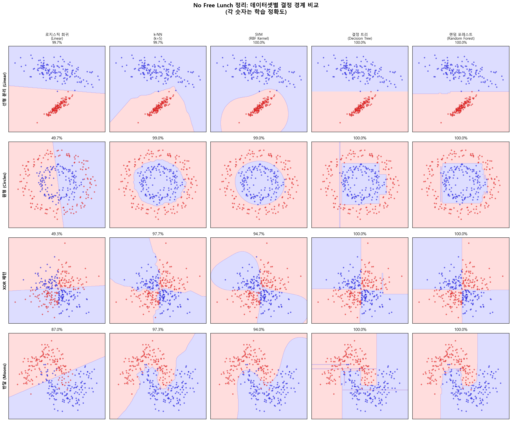
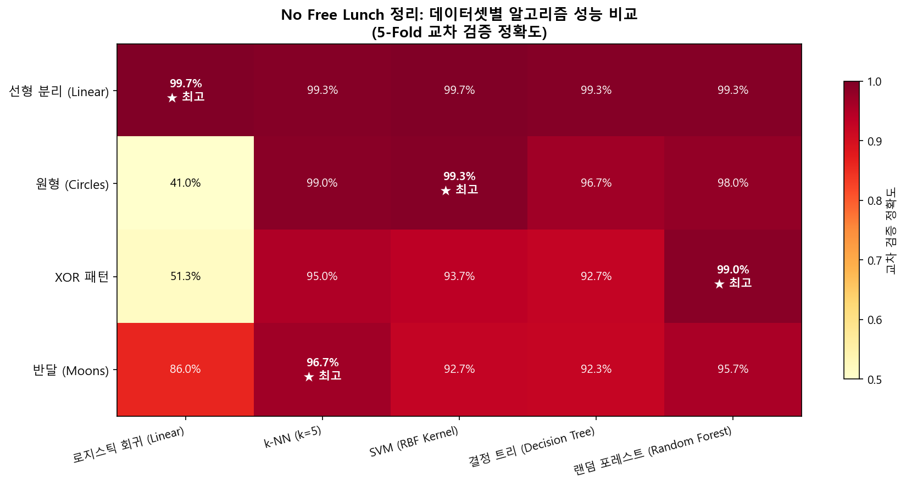
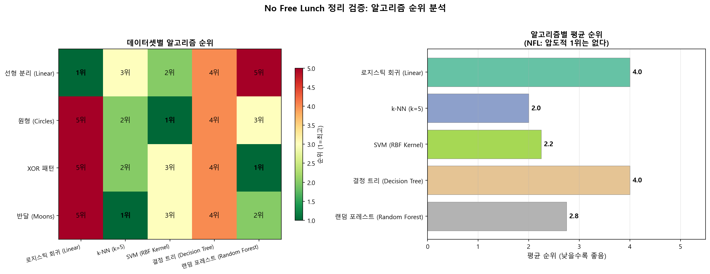

# 02. No Free Lunch 정리 데모

## 개요

| 항목 | 내용 |
|------|------|
| **파일명** | `02_no_free_lunch_demo.py` |
| **주제** | No Free Lunch (NFL) 정리 실험적 검증 |
| **참고 논문** | Wolpert & Macready (1997) "No Free Lunch Theorems for Optimization" |
| **핵심 라이브러리** | NumPy, Matplotlib, scikit-learn |
| **생성 결과물** | `02_decision_boundaries.png`, `02_performance_heatmap.png`, `02_rank_analysis.png` |

---

## 먼저 알아야 할 것: "최고의 알고리즘"은 있을까?

머신러닝을 처음 배우면 자연스럽게 이런 질문을 한다:

- "어떤 알고리즘이 가장 좋은 건가요?"
- "랜덤 포레스트가 만능 아닌가요?"
- "딥러닝이 항상 최고 아닌가요?"

**답은 "아니오"이다.** 1997년에 Wolpert와 Macready가 수학적으로 증명한 **No Free Lunch 정리**는 이렇게 말한다:

> **"모든 문제에서 평균적으로 최고인 알고리즘은 존재하지 않는다."**

이것은 의견이 아니라 **수학적 정리(증명된 사실)** 이다. 즉:

- 알고리즘 A가 문제 1에서 가장 잘하면, 반드시 알고리즘 A가 **못하는 문제 2가 존재**한다
- "만능 알고리즘"이란 **원리적으로 불가능**하다
- 따라서 **문제의 특성을 먼저 파악하고, 그에 맞는 알고리즘을 선택**하는 것이 핵심이다

**이 코드는 NFL 정리를 직접 실험으로 확인한다.** 4가지 서로 다른 데이터에 5가지 알고리즘을 적용해보고, 정말로 "항상 1위"인 알고리즘이 없는지 확인한다.

---

## 배경 지식: 분류(Classification)란?

이 코드는 **분류 문제**를 다룬다. 분류란 데이터를 여러 그룹(클래스)으로 나누는 것이다.

**일상 속 예시:**
- 이메일을 **스팸 / 정상**으로 분류
- 사진 속 동물이 **고양이 / 강아지**인지 분류
- 환자가 **양성 / 악성** 종양인지 분류

2차원 데이터의 경우, 분류 알고리즘은 **결정 경계(Decision Boundary)** 라는 선(또는 곡선)을 그려서 영역을 나눈다. 이 선의 한쪽은 "클래스 A", 반대쪽은 "클래스 B"로 예측한다.

---

## 배경 지식: 귀납적 편향(Inductive Bias)이란?

**핵심 질문**: 같은 데이터를 주면 모든 알고리즘이 같은 결과를 내는가? → **아니다!**

각 알고리즘은 "세상이 이렇게 생겼을 것이다"라는 **암묵적 가정(귀납적 편향)** 을 가지고 있다:

| 알고리즘 | 암묵적 가정 | 쉬운 비유 |
|----------|-----------|----------|
| **로지스틱 회귀** | "클래스 간 경계는 직선이다" | 자로 줄을 긋는 것 |
| **k-NN** | "가까이 있는 것끼리 같은 그룹이다" | "유유상종" — 주변 이웃을 보고 판단 |
| **SVM (RBF)** | "경계를 최대한 넓게 만들되, 곡선도 OK" | 두 그룹 사이에 최대한 넓은 도로를 깔기 |
| **결정 트리** | "네/아니오 질문으로 분류할 수 있다" | 스무고개 게임 |
| **랜덤 포레스트** | "여러 결정 트리의 다수결이 정확하다" | 전문가 100명의 투표 |

**NFL 정리의 핵심 이유**: 이 가정들이 각각 **특정 데이터 구조에만 유리**하기 때문에, 모든 데이터에서 항상 이기는 알고리즘이 있을 수 없다!

---

## 이 코드가 하는 일: 실험 설계

### 4가지 데이터셋 — 각각 다른 구조

이 코드는 의도적으로 **서로 다른 구조**를 가진 4개 데이터셋을 만든다:

**1. 선형 분리 (Linear):**
- 두 클래스가 직선으로 깔끔하게 나뉜다
- 비유: 남녀가 교실 왼쪽/오른쪽에 각각 앉아 있는 상황
- **로지스틱 회귀(직선 경계)에 유리**할 것으로 예상

**2. 원형 (Circles):**
- 한 클래스가 원 안에, 다른 클래스가 원 바깥에 있다 (동심원 구조)
- 비유: 과녁의 가운데와 바깥쪽을 구분하는 것
- 직선으로는 절대 분리 불가 → **SVM(RBF 커널)에 유리**할 것으로 예상

**3. XOR 패턴:**
- 1사분면과 3사분면이 한 클래스, 2사분면과 4사분면이 다른 클래스
- 비유: 체스판의 검정/흰색 칸처럼 대각선으로 교차
- **결정 트리에 유리**할 것으로 예상 (네/아니오 질문으로 X축, Y축을 나누면 됨)

**4. 반달 (Moons):**
- 두 반달이 맞물린 형태
- 비유: 두 손가락이 서로 엇갈리게 걸린 모양
- 복잡한 비선형 경계 필요 → **k-NN이나 비선형 모델에 유리**할 것으로 예상

### 5가지 분류 알고리즘

각 알고리즘을 간단히 설명하면:

**로지스틱 회귀 (Logistic Regression):**
- 가장 단순한 분류 모델 중 하나
- 직선(또는 초평면)으로 공간을 둘로 나눈다
- 장점: 빠르고, 해석이 쉬움 / 단점: 비선형 패턴을 포착 못함

**k-최근접 이웃 (k-NN, k=5):**
- 새로운 데이터가 들어오면, 가장 가까운 5개 이웃의 "다수결"로 분류한다
- 장점: 직관적, 어떤 형태의 경계든 학습 가능 / 단점: 느리고, 고차원에서 성능 저하

**SVM (RBF 커널):**
- 데이터를 고차원 공간으로 변환하여, 그곳에서 최적의 분리 평면을 찾는다
- RBF 커널 = 데이터를 무한 차원으로 올려서 비선형 경계를 만든다
- 장점: 이론적으로 강력 / 단점: 대용량 데이터에서 느림

**결정 트리 (Decision Tree, max_depth=10):**
- "X1 > 0.5인가?" → "그렇다면 X2 > 0.3인가?" 식의 질문 체인으로 분류
- 결정 경계가 항상 **축에 평행한 직선**으로만 이루어진다 (계단 모양)
- 장점: 해석이 쉬움 / 단점: 과적합하기 쉬움

**랜덤 포레스트 (Random Forest, 100그루):**
- 결정 트리 100개를 각각 다른 데이터 부분으로 학습시키고, 다수결로 최종 결정
- 장점: 과적합 방지, 범용적 / 단점: 해석이 어려움, 느림

### 평가 방법: 5-Fold 교차 검증

- 데이터를 5등분하여, 4/5로 학습하고 1/5로 평가하는 과정을 5번 반복
- 5번의 정확도를 평균 → 공정하고 안정적인 성능 비교
- **Stratified**: 각 폴드에서 클래스 비율을 원본과 동일하게 유지

---

## 코드 구조

```
create_datasets()     → 4개 데이터셋 생성
create_classifiers()  → 5개 분류기 정의
evaluate_all()        → 20개 조합 교차 검증 → scores_matrix (4×5)
plot_decision_boundaries() → 결정 경계 시각화
plot_performance_heatmap() → 성능 히트맵
plot_rank_analysis()       → 순위 분석
print_comparison_table()   → 콘솔 결과 표
```

---

## 결과물 분석

### 결과 1: 데이터셋별 결정 경계 비교



**이 그림을 읽는 법:**

이 그림은 **4행(데이터셋) × 5열(알고리즘) = 20개의 패널**로 구성되어 있다.

- **배경 색상** (빨간색/파란색) = 알고리즘이 "이 위치의 데이터는 클래스 A/B이다"라고 예측하는 영역
- **점** = 실제 데이터 포인트 (빨간 점 = 클래스 A, 파란 점 = 클래스 B)
- **숫자** = 학습 정확도 (이 데이터에서 맞춘 비율)

**1행: 선형 분리 데이터 — "직선으로 충분한 경우"**
- 로지스틱 회귀가 깔끔한 직선 경계로 높은 정확도 달성
- 다른 알고리즘도 잘하지만, **단순한 로지스틱 회귀만으로 충분**
- 교훈: 데이터가 단순하면 복잡한 모델이 필요 없다 ("Occam의 면도날")

**2행: 원형 데이터 — "직선이 무용지물인 경우"**
- 로지스틱 회귀(직선 경계)는 **완전히 실패**! 원을 직선으로 나눌 수 없으니까
- SVM(RBF)이 동심원 구조를 **완벽하게 포착** → 원형 경계를 학습
- 교훈: 비선형 데이터에는 비선형 모델이 필수

**3행: XOR 패턴 — "축 정렬 분할이 유리한 경우"**
- 결정 트리와 랜덤 포레스트의 **계단 모양 경계**가 XOR 구조에 자연스럽게 맞음
- SVM도 잘하지만, 결정 트리가 가장 효율적
- 교훈: 알고리즘의 "결정 경계 형태"와 "데이터 구조"가 맞아야 한다

**4행: 반달 데이터 — "부드러운 비선형 경계가 필요한 경우"**
- 로지스틱 회귀만 실패 (직선으로는 반달을 분리 못함)
- k-NN, SVM, 랜덤 포레스트가 부드러운 곡선 경계로 잘 분류
- 교훈: 대부분의 비선형 모델이 잘 작동하지만, "최고"는 데이터마다 다르다

**전체 그림에서 보이는 NFL 정리의 증거:**
- 어떤 열(알고리즘)을 보아도, **모든 행(데이터셋)에서 최고인 알고리즘이 없다**
- 1행에서 최고인 로지스틱 회귀는 2행에서 최악
- 2행에서 최고인 SVM은 다른 행에서 반드시 1위는 아님

---

### 결과 2: 성능 비교 히트맵



**이 그림을 읽는 법:**

4×5 격자의 색상 강도가 교차 검증 정확도를 나타낸다. 진한 색 = 높은 정확도, 옅은 색 = 낮은 정확도.

**핵심 관찰 — "★ 최고" 표시를 따라가 보자:**

- 각 행(데이터셋)에서 "★ 최고"가 **다른 열(알고리즘)에 있다**
- 선형 데이터 → 로지스틱 회귀나 SVM이 최고
- 원형 데이터 → SVM(RBF)이 압도적 최고
- XOR 데이터 → 결정 트리 계열이 최고
- 반달 데이터 → 여러 비선형 모델이 비슷

**이것이 NFL 정리의 직접적 증거이다:**

어떤 알고리즘도 **모든 행에서 ★ 를 독점하지 못한다.** 만약 "만능 알고리즘"이 있었다면, 한 열에 ★가 4개 모두 있어야 한다. 하지만 그런 열은 없다.

---

### 결과 3: 알고리즘별 순위 분석



**이 그림을 읽는 법:**

**왼쪽 패널 — 순위 히트맵:**
- 각 셀의 숫자는 해당 데이터셋에서의 순위 (1위~5위)
- 초록색(1위) → 노란색(중간) → 빨간색(5위)
- **핵심**: 어떤 알고리즘도 4개 데이터셋 모두에서 1위를 차지하지 못한다!

**오른쪽 패널 — 평균 순위 막대 그래프:**
- 4개 데이터셋에 걸친 평균 순위 (낮을수록 좋음)
- 랜덤 포레스트가 평균적으로 무난할 수 있지만, **압도적 1위가 아님**
- 이것은 "가장 안전한 선택"일 수는 있어도, "항상 최고의 선택"은 아님을 보여준다

---

## 핵심 정리: NFL 정리가 우리에게 주는 교훈

### 잘못된 접근 (초보자의 흔한 실수)

- "이 알고리즘이 좋다는 블로그 글을 봤으니, 항상 이것만 쓰겠다"
- "딥러닝이 최고니까 무조건 딥러닝을 쓰겠다"
- "랜덤 포레스트로 되면 다른 건 안 해도 되겠지"

### 올바른 접근 (NFL 정리를 아는 사람)

1. **데이터를 먼저 이해하라**: 시각화하고, 분포를 확인하고, 구조를 파악하라
2. **여러 알고리즘을 시도하라**: 최소 3~5개 이상의 알고리즘을 비교
3. **교차 검증으로 공정하게 비교하라**: 한 번의 테스트로 결론 내리지 마라
4. **Occam의 면도날**: 비슷한 성능이면 **더 단순한 모델**을 선택하라 (해석도 쉽고 과적합도 적다)
5. **도메인 지식을 활용하라**: 데이터의 특성을 알면 적합한 알고리즘을 좁힐 수 있다

### 실무에서의 적용

| 데이터 특성 | 시도할 알고리즘 | 이유 |
|------------|---------------|------|
| 특성 수가 적고 선형적 | 로지스틱 회귀, SVM(linear) | 단순한 모델이 충분 |
| 비선형 패턴이 의심 | SVM(RBF), k-NN, 신경망 | 비선형 경계 학습 필요 |
| 범주형 특성이 많음 | 결정 트리, 랜덤 포레스트 | 범주 분할에 자연스러움 |
| 잘 모르겠다 | 랜덤 포레스트, XGBoost | 범용적이고 기본값이 좋음 |
| 데이터가 매우 많음 | 딥러닝, LightGBM | 대용량에서 스케일링 좋음 |

---

## 실행 방법

```bash
cd 구현소스/
python 02_no_free_lunch_demo.py
```

**필요 패키지**: `numpy`, `matplotlib`, `scikit-learn`

**실행 시간**: 약 30~60초 (결정 경계 메시 그리드 계산이 주요 소요 시간)

**출력 파일**:
- `02_decision_boundaries.png` — 데이터셋별 결정 경계 비교 (4×5 격자)
- `02_performance_heatmap.png` — 교차 검증 성능 히트맵
- `02_rank_analysis.png` — 알고리즘별 순위 분석
