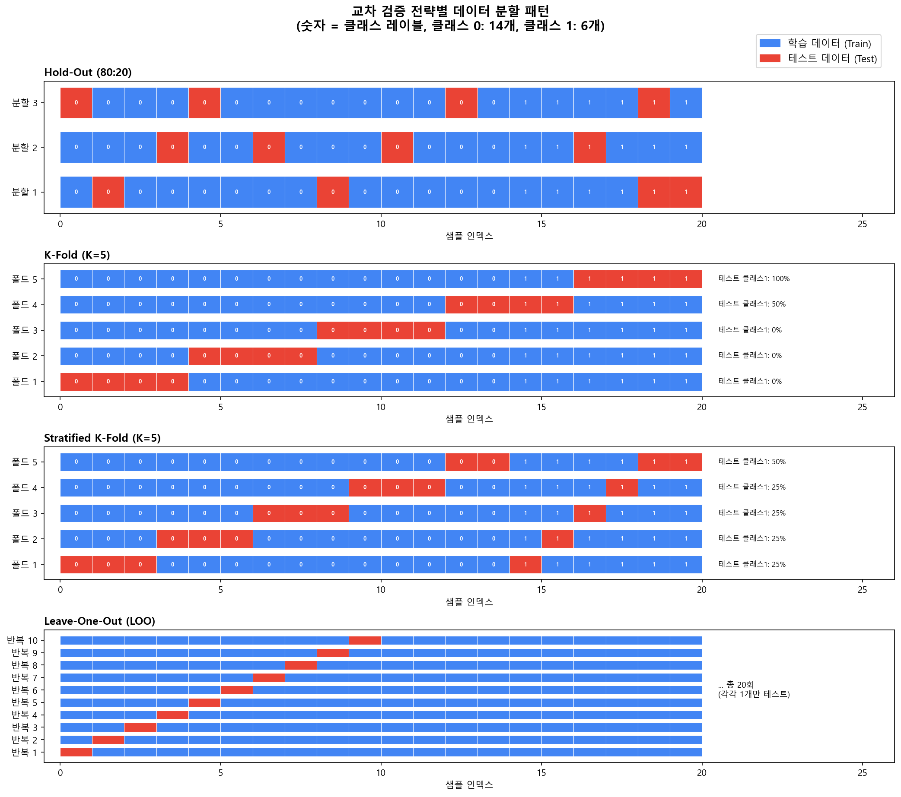
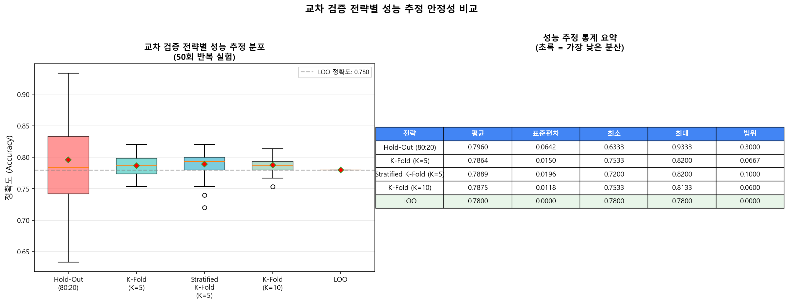
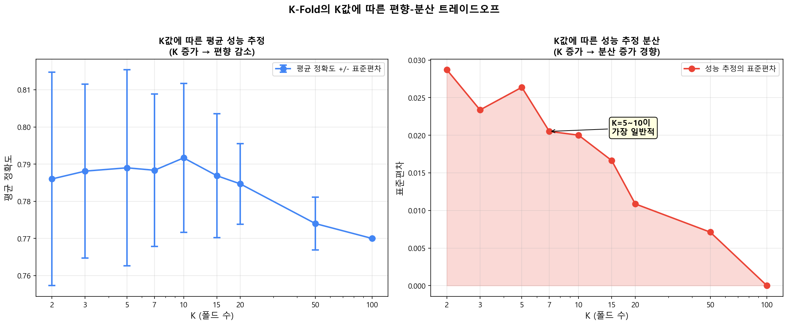
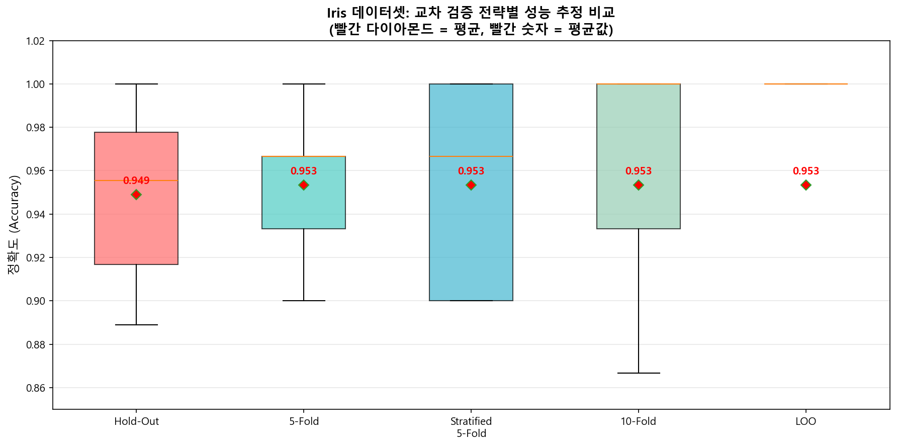

# 03. 교차 검증 (Cross-Validation) 전략 비교 데모

## 개요

| 항목 | 내용 |
|------|------|
| **파일명** | `03_cross_validation_demo.py` |
| **주제** | 교차 검증 전략별 원리, 데이터 분할 패턴, 성능 추정 안정성 비교 |
| **핵심 라이브러리** | NumPy, Matplotlib, scikit-learn |
| **비교 전략** | Hold-Out, K-Fold, Stratified K-Fold, Leave-One-Out (LOO) |
| **생성 결과물** | `03_cv_splits.png`, `03_variance_comparison.png`, `03_k_tradeoff.png`, `03_iris_cv_comparison.png` |

---

## 먼저 알아야 할 것: 왜 교차 검증이 필요한가?

### 문제 상황: 내 모델이 얼마나 잘하는지 어떻게 알까?

모델을 만들었다. 학습 데이터에서 95% 정확도가 나왔다. **이 모델을 실제로 써도 될까?**

**답: 알 수 없다.** 학습 데이터에서의 성능은 **아무 의미가 없다.** 시험 문제를 미리 본 학생이 100점을 받는 것과 같다.

우리가 정말 알고 싶은 것은: **"이 모델이 아직 보지 못한 새로운 데이터에서도 잘 작동할까?"** 이다.

### 가장 단순한 방법: 데이터를 나누자

가장 직관적인 방법은 데이터를 **학습용**과 **테스트용**으로 나누는 것이다:

1. 전체 데이터 100개 중 80개로 모델을 학습
2. 나머지 20개로 성능을 테스트
3. 이 20개에서의 정확도가 "실제 성능"의 추정값

**그런데 이 방법에는 심각한 문제가 있다:**

- **어떤 20개를 테스트로 뽑느냐에 따라 결과가 크게 달라진다!**
- 운 좋게 쉬운 데이터가 테스트에 들어가면 → 성능이 높게 나옴
- 운 나쁘게 어려운 데이터가 테스트에 들어가면 → 성능이 낮게 나옴
- 한 번의 분할로 "이 모델의 정확도는 92%입니다"라고 보고하면, 이 숫자를 **신뢰할 수 없다**

### 교차 검증의 아이디어

**"그러면 여러 번 나누어서 평균을 내면 되지 않을까?"** → 이것이 바로 교차 검증이다!

교차 검증은 데이터를 여러 번 다르게 나누고, 매번 학습/평가를 반복하고, 그 결과의 **평균**을 최종 성능으로 보고한다. 이렇게 하면 "운에 따른 변동"을 줄일 수 있다.

---

## 4가지 교차 검증 전략 상세 설명

### 전략 1: Hold-Out (홀드아웃)

**가장 단순한 방법이지만, 가장 불안정하다.**

**방법:**
1. 데이터를 한 번만 학습/테스트로 나눈다 (보통 80:20 또는 70:30)
2. 한 번 학습하고, 한 번 평가한다
3. 끝!

**비유:** 수학 시험을 단 1회만 보고, 그 점수로 실력을 판단하는 것. 그 날 컨디션이 좋았거나 문제가 쉬웠을 수도 있는데, 한 번만 보고 판단하니 불안하다.

**장점:** 매우 빠르다 (1번만 학습하면 됨)

**단점:**
- 어떻게 나누느냐에 따라 결과가 크게 달라진다 (높은 분산)
- 데이터의 20%를 학습에 사용하지 않으므로 낭비

**언제 사용?** 데이터가 아주 많을 때 (100만 건 이상), 빠른 프로토타이핑할 때

### 전략 2: K-Fold (K-폴드 교차 검증)

**교차 검증의 표준 방법.**

**방법:**
1. 데이터를 **K개의 동일한 크기 조각(폴드)** 으로 나눈다
2. 1번째 폴드를 테스트, 나머지 K-1개를 학습 → 정확도 기록
3. 2번째 폴드를 테스트, 나머지 K-1개를 학습 → 정확도 기록
4. ...
5. K번째 폴드를 테스트, 나머지 K-1개를 학습 → 정확도 기록
6. K번의 정확도의 **평균** = 최종 성능 추정

**K=5일 때 예시 (데이터 100개):**

| 라운드 | 학습 데이터 | 테스트 데이터 |
|--------|-----------|-------------|
| 1회차 | 폴드 2,3,4,5 (80개) | 폴드 1 (20개) |
| 2회차 | 폴드 1,3,4,5 (80개) | 폴드 2 (20개) |
| 3회차 | 폴드 1,2,4,5 (80개) | 폴드 3 (20개) |
| 4회차 | 폴드 1,2,3,5 (80개) | 폴드 4 (20개) |
| 5회차 | 폴드 1,2,3,4 (80개) | 폴드 5 (20개) |

**비유:** 수학 시험을 5번 보되, 매번 다른 문제 세트로 시험을 본다. 5번의 점수를 평균 내면 실력을 더 정확히 파악할 수 있다.

**장점:**
- 모든 데이터가 한 번씩은 테스트에 사용됨 → 데이터 낭비 없음
- 여러 번 평균하므로 Hold-Out보다 안정적

**단점:**
- K번 학습해야 하므로 K배 느림
- 클래스 비율이 폴드마다 다를 수 있음 (다음 전략에서 해결)

### 전략 3: Stratified K-Fold (층화 K-폴드)

**실무에서 가장 많이 추천되는 방법. sklearn의 기본 설정이기도 하다.**

**문제**: 만약 데이터에 양성 30개, 음성 70개가 있는데, 어떤 폴드에는 양성이 0개만 들어간다면? 그 폴드에서의 평가는 전혀 의미가 없다!

**Stratified K-Fold의 해결책:**
- K-Fold와 동일하되, **각 폴드에서 클래스 비율을 원본과 동일하게 유지**한다
- 원본에서 양성:음성 = 30:70이면, 모든 폴드에서도 약 30:70이 되도록 배분

**비유:** 남녀 비율이 4:6인 학교에서 반 편성을 할 때, 각 반의 남녀 비율도 4:6으로 맞추는 것. 이렇게 해야 각 반에서의 결과가 전체를 대표할 수 있다.

**장점:**
- 불균형 데이터에서도 안정적인 성능 추정
- 각 폴드가 전체 데이터의 축소판

**단점:**
- 분류 문제에서만 사용 가능 (회귀 문제에는 "클래스"가 없으므로)

**언제 사용?** 분류 문제에서는 **항상 이것을 기본으로 사용하라!**

### 전략 4: Leave-One-Out (LOO, 1개씩 빼기)

**가장 극단적인 교차 검증.**

**방법:**
1. 데이터가 N개일 때, **한 번에 1개만 테스트**로 빼고, 나머지 N-1개로 학습
2. 이것을 N번 반복 (모든 데이터가 한 번씩 테스트됨)
3. N번의 결과(맞음/틀림)의 평균 = 최종 성능

**비유:** 100명의 학생이 있을 때, 1명을 빼고 99명으로 모델을 만들어 그 1명을 예측. 이것을 100명 각각에 대해 반복.

**장점:**
- **거의 전체 데이터로 학습**하므로 편향이 가장 낮다
- 데이터가 매우 적을 때 유용 (10~50개 정도)

**단점:**
- **계산 비용이 엄청나다**: 데이터 N개 = N번 학습. 데이터가 10,000개면 10,000번 학습해야 함
- 각 평가가 1개 데이터에만 의존하므로 (맞음=1, 틀림=0), 분산이 높을 수 있다

**언제 사용?** 데이터가 매우 적을 때 (50개 이하)

### 전략 비교 요약

| 전략 | 학습 횟수 | 편향 | 안정성(분산) | 속도 | 추천 상황 |
|------|----------|------|------------|------|----------|
| Hold-Out | 1회 | 높음 | 불안정 | 매우 빠름 | 데이터 대용량 |
| K-Fold (K=5) | 5회 | 중간 | 안정적 | 보통 | 일반적 사용 |
| Stratified K-Fold | 5회 | 중간 | 매우 안정 | 보통 | 분류 문제 기본 |
| LOO | N회 | 낮음 | 불안정 가능 | 매우 느림 | 데이터 소량 |

---

## 이 코드가 하는 일: 전체 흐름

```
[시각화 1] 4가지 전략이 데이터를 어떻게 나누는지 시각화 → 03_cv_splits.png
[시각화 2] 각 전략을 50번 반복하여 결과 안정성 비교 → 03_variance_comparison.png
[시각화 3] K값을 변화시키며 편향-분산 트레이드오프 확인 → 03_k_tradeoff.png
[시각화 4] 실제 Iris 데이터셋에서 전략별 성능 비교 → 03_iris_cv_comparison.png
```

---

## 결과물 분석

### 결과 1: 교차 검증 분할 패턴



**이 그림을 읽는 법:**

이 그림은 20개의 데이터(가로축의 각 칸)를 4가지 전략이 어떻게 학습(파란색)/테스트(빨간색)로 나누는지 보여준다. 각 칸 안의 숫자(0 또는 1)는 **클래스 레이블**이다.

**중요**: 이 데이터는 의도적으로 **불균형**이다 — 클래스 0이 14개, 클래스 1이 6개. 이 불균형이 있어야 Stratified K-Fold의 장점이 드러난다.

**1행: Hold-Out (80:20)**
- 3번의 서로 다른 랜덤 분할을 보여준다
- **핵심 관찰**: 매번 빨간색(테스트) 위치가 완전히 다르다!
- 분할 1에서 테스트에 클래스 1이 3개 들어갈 수도, 분할 2에서는 1개만 들어갈 수도 있다
- 이것이 Hold-Out의 **불안정성의 원인**이다

**2행: K-Fold (K=5)**
- 데이터를 5개 연속 블록으로 나누고, 돌아가면서 1블록씩 테스트에 사용
- 모든 데이터가 정확히 1번 테스트에 사용된다 → 데이터 낭비 없음
- **문제**: 오른쪽에 표시된 "테스트 클래스1" 비율을 보면, 폴드마다 클래스 비율이 다르다!
- 예를 들어, 폴드 1의 테스트에는 클래스 1이 0개이고, 폴드 5에는 3개일 수 있다

**3행: Stratified K-Fold (K=5)**
- K-Fold와 같은 원리이지만, **각 폴드의 클래스 비율을 원본(70:30)과 동일하게 유지**
- 오른쪽의 "테스트 클래스1" 비율을 보면, **모든 폴드에서 비슷한 비율**이다!
- 이것이 불균형 데이터에서 Stratified가 더 안정적인 이유

**4행: Leave-One-Out (LOO)**
- 한 번에 1개(빨간색)만 테스트, 나머지 19개(파란색)로 학습
- 총 20회 반복 (여기서는 10회만 표시)
- 학습 데이터가 거의 전체(19/20 = 95%)이므로 편향은 낮지만, 1개만으로 평가하므로 결과가 0 또는 1뿐

---

### 결과 2: 성능 추정 분산 비교



**이 그림을 읽는 법:**

5가지 교차 검증 전략에 대해 **"같은 실험을 50번 반복하면 결과가 얼마나 달라지는가"** 를 보여준다.

**왼쪽: 박스 플롯 (Box Plot)**

박스 플롯 읽는 법을 먼저 알아야 한다:
- **상자의 윗변**: 상위 25% 경계 (Q3)
- **상자의 아랫변**: 하위 25% 경계 (Q1)
- **상자 안의 주황색 선**: 중앙값 (50번 중 25번째 값)
- **빨간 다이아몬드**: 평균값
- **수염(위아래 선)**: 전체 분포의 범위
- 상자가 **좁을수록 결과가 안정적**, 넓을수록 불안정

**각 전략별 해석:**

| 전략 | 상자 크기 | 해석 |
|------|----------|------|
| **Hold-Out** | **가장 넓다** | 어떻게 나누느냐에 따라 정확도가 크게 변한다. 한 번은 88%, 다음은 93%... **매우 불안정** |
| **K-Fold (K=5)** | 좁아짐 | 5번 평균하므로 안정화. 하지만 여전히 약간의 변동 |
| **Stratified K-Fold** | 더 좁음 | 클래스 비율까지 맞추므로 **가장 실용적으로 안정적** |
| **K-Fold (K=10)** | 비슷하거나 더 좁음 | 10번 평균하므로 5-Fold보다 약간 더 안정 |
| **LOO** | **점 하나** | 결정적이므로 항상 같은 결과 (분산=0). 하지만 이것이 "정확하다"는 의미는 아님 |

**오른쪽: 통계 요약 표**
- 초록색으로 강조된 행이 **LOO를 제외하고 분산이 가장 낮은 전략**
- Hold-Out의 "범위"(최대-최소)가 가장 크다 → **절대 Hold-Out만으로 성능을 보고하지 마라!**

**핵심 교훈**: 논문이나 보고서에서 "이 모델의 정확도는 93%입니다"라고 쓸 때, 그 93%가 **얼마나 신뢰할 수 있는가**가 중요하다. Hold-Out으로 얻은 93%는 실제로 88~97% 사이 어딘가일 수 있지만, Stratified K-Fold로 얻은 93%는 92~94% 사이에서 안정적이다.

---

### 결과 3: K값에 따른 편향-분산 트레이드오프



**이 그림을 읽는 법:**

K-Fold에서 **K값을 2부터 100(=LOO)까지 변화시키면** 성능 추정이 어떻게 달라지는지 보여준다.

**왼쪽 패널 — 평균 정확도 (편향과 관련):**

- **K가 작을 때 (K=2~3)**: 평균 정확도가 **낮게 나온다**
  - 왜? K=2이면 데이터의 50%로만 학습 → 학습 데이터가 부족해 모델이 제대로 학습 못함
  - 이것은 모델의 진짜 성능보다 **과소 추정**하는 것 = **높은 편향**
  - 비유: 교과서의 절반만 읽고 시험 보면, 실력보다 점수가 낮게 나온다

- **K가 클수록**: 평균 정확도가 점점 **올라간다**
  - K=10이면 90%로 학습 → 거의 전체 데이터를 사용하므로 모델이 잘 학습됨
  - 진짜 성능에 **더 가까운 추정** = **낮은 편향**

- **K=100 (LOO)**: 99%의 데이터로 학습 → 편향이 가장 낮음

**오른쪽 패널 — 표준편차 (안정성과 관련):**

- **K가 작을 때**: 의외로 분산이 그리 높지 않다
  - 왜? 폴드 간 학습 데이터가 서로 많이 다르므로, 각 폴드의 결과가 **독립적**이다

- **K가 중간 (5~10)**: 적절한 수준의 분산

- **K가 매우 클 때**: 분산이 증가할 수 있다
  - 왜? K=100이면, 폴드 1의 학습 데이터와 폴드 2의 학습 데이터가 99개 중 98개 동일
  - 거의 같은 데이터로 학습하므로 결과가 서로 **매우 비슷** → 독립성이 낮다

**"K=5~10이 가장 일반적" 주석:** 이 범위가 편향과 분산의 적절한 균형점이다.

**실무 가이드:**
| K값 | 편향 | 분산 | 계산 비용 | 추천도 |
|-----|------|------|----------|-------|
| 2~3 | 높음 | 낮음 | 빠름 | 비추천 (편향 너무 높음) |
| 5 | 적절 | 적절 | 보통 | 추천 (sklearn 기본값) |
| 10 | 낮음 | 적절 | 보통 | 추천 (더 정밀한 추정) |
| 20+ | 매우 낮음 | 높을 수 있음 | 느림 | 특수한 경우만 |
| N (LOO) | 가장 낮음 | 높을 수 있음 | 매우 느림 | 데이터 극소량일 때만 |

---

### 결과 4: Iris 데이터셋 실전 예제



**이 그림을 읽는 법:**

지금까지는 합성(가짜) 데이터로 실험했다면, 이제는 **실제 데이터(Iris)** 로 확인한다.

**Iris 데이터셋이란?**
- 붓꽃(Iris) 150송이의 꽃잎/꽃받침 길이와 너비 4가지를 측정한 데이터
- 3종류(Setosa, Versicolor, Virginica) 각 50개
- 머신러닝에서 가장 유명한 입문용 데이터셋

**각 전략의 결과:**

- **Hold-Out**: 상자가 가장 넓다 (분포가 넓다)
  - 10번 반복했을 때 정확도가 약 91%~100%까지 변동
  - "이 모델의 정확도는 95%입니다"라고 보고해도, 실제로는 91%~100% 사이 어딘가
  - **신뢰성이 낮다**

- **5-Fold / Stratified 5-Fold**: 상자가 좁아진다
  - 정확도 추정이 더 안정적
  - 5개의 점(각 폴드의 정확도)이 보인다

- **10-Fold**: 10개의 점. 더 많은 평가로 인해 분포가 더 세밀하다

- **LOO**: 150개의 개별 결과(각각 0=틀림 또는 1=맞음)
  - 평균은 다른 방법과 비슷하지만, 분포의 의미가 다르다 (이진값의 분포)

**핵심 관찰:**
- Iris는 비교적 "쉬운" 데이터이므로 모든 전략에서 높은 정확도(~96-97%)
- 그런데도 **Hold-Out의 변동성은 뚜렷** → "쉬운 데이터에서도 Hold-Out은 불안정하다"
- 어려운 데이터에서는 이 차이가 더 크게 벌어진다

---

## 핵심 정리: 교차 검증 전략 선택 가이드

### 초보자를 위한 3줄 요약

1. **분류 문제라면 Stratified K-Fold를 기본으로 사용하라** (K=5 또는 K=10)
2. **절대 Hold-Out만으로 최종 성능을 보고하지 마라** (운에 따라 크게 달라짐)
3. **데이터가 매우 적으면(50개 이하) LOO를 고려하라**

### 데이터 크기별 권장

| 데이터 크기 | 권장 전략 | 이유 |
|------------|----------|------|
| **대용량 (10,000개 이상)** | Hold-Out 또는 3-Fold | 데이터가 충분하므로 한 번 나눠도 안정적. 속도 중요 |
| **중간 (100~10,000개)** | Stratified 5-Fold 또는 10-Fold | 편향과 분산의 좋은 균형. 가장 범용적 |
| **소량 (50~100개)** | Repeated Stratified K-Fold | K-Fold를 여러 번 반복하여 더 안정적으로 |
| **극소량 (50개 이하)** | LOO | 모든 데이터를 최대한 활용해야 함 |

### 데이터 유형별 권장

| 데이터 유형 | 권장 전략 | 이유 |
|------------|----------|------|
| **균형 분류** (각 클래스 비슷) | K-Fold (K=5~10) | 클래스 비율이 균형이므로 기본 K-Fold 충분 |
| **불균형 분류** (한 클래스가 적음) | **Stratified K-Fold** | 각 폴드의 클래스 비율 보장이 필수! |
| **회귀 문제** | K-Fold (K=5~10) | Stratified는 분류 전용 (클래스 개념이 없으므로) |
| **시계열 데이터** | Time Series Split | 미래 데이터로 학습 → 과거 예측하면 안 됨. 시간 순서 존중 필수 |
| **그룹 데이터** (같은 환자의 여러 기록 등) | Group K-Fold | 같은 그룹이 학습/테스트에 동시에 들어가면 데이터 누수! |

### sklearn에서의 사용법

```python
from sklearn.model_selection import cross_val_score, StratifiedKFold

# 가장 기본적인 사용법 (기본값 = Stratified 5-Fold)
scores = cross_val_score(model, X, y, cv=5, scoring='accuracy')
print(f"정확도: {scores.mean():.3f} +/- {scores.std():.3f}")

# 명시적으로 Stratified K-Fold 지정
cv = StratifiedKFold(n_splits=10, shuffle=True, random_state=42)
scores = cross_val_score(model, X, y, cv=cv)
```

---

## 실행 방법

```bash
cd 구현소스/
python 03_cross_validation_demo.py
```

**필요 패키지**: `numpy`, `matplotlib`, `scikit-learn`

**실행 시간**: 약 30~90초 (LOO의 150회 반복이 주요 소요 시간)

**출력 파일**:
- `03_cv_splits.png` — 교차 검증 분할 패턴 시각화
- `03_variance_comparison.png` — 성능 추정 분산 비교 (박스 플롯 + 통계 표)
- `03_k_tradeoff.png` — K값에 따른 편향-분산 트레이드오프
- `03_iris_cv_comparison.png` — Iris 데이터셋 실전 CV 비교
